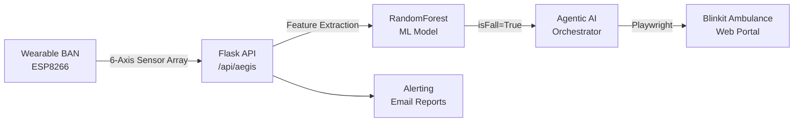

# Aegis — IoT Health Sentinel with Agentic AI

[]()
[]()
[]()
[]()
[]()

> Aegis is an end-to-end wearable health ecosystem. It combines an ESP8266 Body Area Network (BAN) with a Machine Learning backed Flask API. 
> Crucially, it features an **Agentic AI Orchestrator** that uses "Computer Use" (Browser Automation) to autonomously stage medical responses in real-time.

An end-to-end fall detection and alert platform that connects a wearable to a cloud backend and ML inference pipeline. The system detects high-impact events using a Random Forest classifier, evaluates vitals, and automatically spawns a Browser Agent to stage an emergency ambulance via Blinkit.

## Table of contents

- [System architecture](#system-architecture)
- [Key capabilities](#key-capabilities)
- [Project structure](#project-structure)
- [Setup and configuration](#setup-and-configuration)
- [Run the system](#run-the-system)
- [The Agentic AI Workflow](#the-agentic-ai-workflow)

## System architecture



## Key capabilities

- **Real-Time ML Inference**: The wearable buffers 3 seconds of raw 6-axis IMU data and sends it to the backend. The backend uses a trained Random Forest model (analyzing skewness, kurtosis, variance) to verify a fall.
- **Agentic Computer Use**: If a fall is detected, an AI agent physically launches a headless/headed browser, navigates to the Blinkit Ambulance portal, inputs GPS coordinates, and stages an emergency response.
- Vitals telemetry (G-force, BPM, SpO2) streamed to a live React dashboard.
- Multi-level alerting modes (critical fall, welfare check, clinical intervention).
- Automated email dispatch with location context, PDFs, and diagnostic charts.

## Project structure

```
.
├─ app.py                       # Live Flask backend (ML Engine + Agent Trigger)
├─ agent/
│  └─ agent_actions.py          # Playwright computer-use script (Blinkit)
├─ hardware_code/               # ESP8266 sketch (Buffers 6-axis data)
├─ models/                      # Trained RandomForest model and scalers
├─ kinetics-dashboard/          # React + Vite UI
├─ dataset/                     # Training dataset + conversion helper
├─ location_scripts/            # Alerting helpers and hospital lookup
├─ legacy/                      # Old ThingSpeak polling scripts
└─ training_scripts/            # Model training and evaluation
```

## Setup and configuration

### Prerequisites

- Python 3.9+ 
- Node.js 18+ (dashboard)
- Arduino IDE (hardware sketch)

### Environment variables
Create a `.env` file in the root:

```
KINETICS_SENDER_EMAIL=your.sender@gmail.com
KINETICS_SENDER_PASS=your_app_password
KINETICS_RECIPIENT_EMAIL=recipient@example.com
GEMINI_API_KEY=your_gemini_api_key_here
```

### Install Playwright (For the AI Agent)
The agent uses Playwright to control the browser:
```bash
pip install playwright
playwright install
```

## Run the system

1. **Start the Backend:**
```bash
pip install -r requirements.txt
python app.py
```
2. **Start the Dashboard:**
```bash
cd kinetics-dashboard
npm install
npm run dev
```
3. **Hardware:** Flash the `hardware_code/data_Node_code.ino` to your ESP8266. Use the physical button to spoof a fall for testing.

## The Agentic AI Workflow (Computer Use)
To demonstrate true Agentic capabilities, the system uses a **Human-in-the-Loop (HITL)** architecture. 
When the ML model confirms a fall, the Agent spawns a background thread that uses Playwright to open a Chrome instance. It navigates the Blinkit Ambulance booking portal entirely autonomously. 
*Note for recruiters/testers: The script intentionally halts at the final verification step to prevent actual credit card charges and fake ambulance dispatching.*
