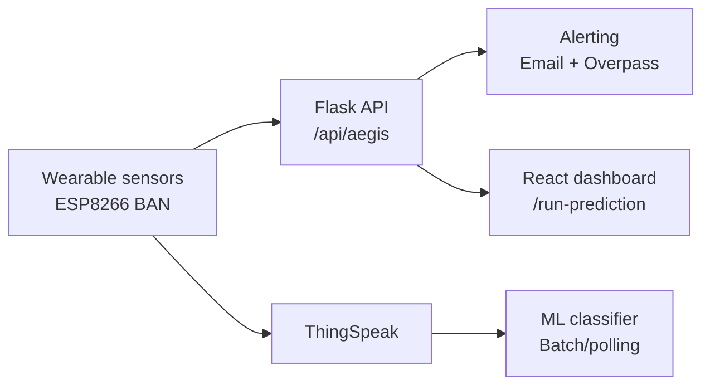

# Aegis — IoT Health Sentinel

[]()
[]()
[]()
[]()
[]()

> Aegis moves beyond passive monitoring. It is a full-stack SaaS health
> ecosystem where the hardware acts as the enabler and the software acts
> as the intelligent caretaker — distinguishing between acute emergencies
> that need immediate intervention and chronic degradation that needs
> long-term care routing.

An end-to-end fall detection and alert platform that connects a wearable Body Area Network (BAN) to a cloud backend, ML inference pipeline, and a live monitoring dashboard. The system detects high-impact events, evaluates vitals, and automatically dispatches alerts with patient and location context, while supporting Environment-as-a-Service responses and the Shanti Protocol for chronic care routing.

## Table of contents

- [What this repository includes](#what-this-repository-includes)
- [System architecture](#system-architecture)
- [Key capabilities](#key-capabilities)
- [Project structure](#project-structure)
- [Setup and configuration](#setup-and-configuration)
- [Run the backend API](#run-the-backend-api)
- [Run the dashboard](#run-the-dashboard)
- [Hardware sketch](#hardware-sketch)
- [ML training and batch inference](#ml-training-and-batch-inference)
- [n8n closed-loop workflow](#n8n-closed-loop-workflow)
- [API reference](#api-reference)
- [Alerting and notifications](#alerting-and-notifications)
- [Deployment](#deployment)
- [Security and privacy notes](#security-and-privacy-notes)
- [Contributing](#contributing)
- [License](#license)

## What this repository includes

- A Flask backend that receives hardware telemetry, detects fall events, and pushes alerts.
- A React + Vite operations dashboard (Kinetics) for live vitals, AI reasoning, and incident UI.
- ML training scripts and feature engineering for fall classification.
- A standalone ThingSpeak polling + ML prediction script for batch detection.
- Hardware firmware for ESP8266-based BAN telemetry.
- Optional n8n workflow for closed-loop incident triage and escalation.

## System architecture



## Key capabilities

- Real-time fall detection with configurable impact threshold.
- Vitals telemetry (G-force, BPM, SpO2) streamed to a dashboard.
- Multi-level alerting modes (critical fall, welfare check, clinical intervention).
- Email dispatch with location context and automated messaging.
- Nearby hospital lookup via Overpass API.
- Closed-loop incident workflow (n8n) with triage and escalation logic.
- Environment-as-a-Service response layer for physical interventions.
- Proof of Life status on the dashboard — caregivers see continuous
    presence confirmation, not just alerts when something goes wrong.
- Diya Mode — on a confirmed fall, integrated relays trigger ambient
    lighting changes in the patient's environment to guide responders
    and reduce panic.
- Smart door unlock via relay actuation — paramedic access without
    waiting for someone to physically open the door.
- Shanti Protocol routing for chronic degradation without alarm fatigue.

## Project structure

```
.
├─ app.py                       # Flask backend (live API + alert modes)
├─ fall_detection.py            # ThingSpeak polling + ML inference
├─ requirements.txt
├─ render.yaml                  # Render deployment config
├─ dataset/                     # Training dataset + conversion helper
├─ hardware_code/               # ESP8266 sketch
├─ kinetics-dashboard/          # React + Vite UI
├─ location_scripts/            # Alerting helpers and hospital lookup
├─ models/                      # Trained models and scalers (generated)
├─ n8n/                         # Closed-loop workflow + sample payload
└─ training_scripts/            # Model training and evaluation
```

## Setup and configuration

### Prerequisites

- Python 3.9+ (backend, ML scripts)
- Node.js 18+ (dashboard)
- Arduino IDE (hardware sketch)
- Gmail account with App Password (for SMTP alerts)

### Environment variables (backend + alerts)

The backend supports either KINETICS_* or ALERT_EMAIL_* names:

```
KINETICS_SENDER_EMAIL=your.sender@gmail.com
KINETICS_SENDER_PASS=your_app_password
KINETICS_RECIPIENT_EMAIL=recipient@example.com

ALERT_EMAIL_SENDER=your.sender@gmail.com
ALERT_EMAIL_PASSWORD=your_app_password
ALERT_EMAIL_RECEIVER=recipient@example.com
```

These are read in [app.py](app.py) and [location_scripts/send_alert_email.py](location_scripts/send_alert_email.py).

## Run the backend API

```bash
python -m venv .venv
.
.venv\Scripts\Activate.ps1
pip install -r requirements.txt
python app.py
```

The API starts on http://localhost:5000.

## Run the dashboard

```bash
cd kinetics-dashboard
npm install
npm run dev
```

By default the dashboard polls `/run-prediction` on port 5000. Override with:

```
VITE_API_URL=http://localhost:5000/run-prediction
```

## Hardware sketch

The ESP8266 firmware is in [hardware_code/data_Node_code.ino](hardware_code/data_Node_code.ino).

It reads:

- MPU6050 (accelerometer/gyro)
- MAX30100 (heart rate)

Update WiFi credentials and flash via Arduino IDE. The sketch currently prints telemetry to serial; for live ingestion, add a simple HTTP POST to `/api/aegis` or a ThingSpeak write call.

## ML training and batch inference

### Train and export models

Training scripts are in [training_scripts](training_scripts) and use the CSV in [dataset/fall_dataset.csv](dataset/fall_dataset.csv).

Example:

```bash
python training_scripts/train_random_forest.py
```

Artifacts are saved to [models](models), typically `fall_detection_model.pkl` and `scaler.pkl`.

### Batch inference (ThingSpeak polling)

[fall_detection.py](fall_detection.py) pulls the latest sensor window from ThingSpeak, extracts features, runs inference, and sends an alert using [location_scripts/send_alert_email.py](location_scripts/send_alert_email.py).

ThingSpeak channel credentials are configured via environment variables — see Setup and configuration.

## n8n closed-loop workflow

The [n8n](n8n) folder includes a workflow that validates incoming payloads, triages risk, executes interventions, and verifies acknowledgements. Import instructions are in [n8n/README.md](n8n/README.md).

## API reference

### POST /api/aegis

Receives telemetry from the wearable hardware.

```json
{
    "token": "AEGIS_AUTH_774",
    "event": "HIGH IMPACT FALL",
    "gForce": 17.6,
    "bpm": 108,
    "o2": 88,
    "location": "12.824589,80.046896"
}
```

Response:

```json
{
    "status": "data_received",
    "isFall": true
}
```

### GET /run-prediction

Polled by the dashboard every second and returns current vitals plus patient metadata.

## Alerting and notifications

The backend supports three alert modes in [app.py](app.py):

- Mode C: fall detected (immediate emergency dispatch)
- Mode B: abnormal vitals (clinical intervention)
- Mode A: minor trip/stumble (welfare check)

Each alert is rate-limited per event to avoid spam. The email templates include vitals and location context.

## Response protocols

Aegis classifies every event into one of two tracks:

**Acute emergencies** — high G-force impact with abnormal vitals triggers
Mode C: immediate email dispatch, nearby hospital lookup via Overpass API,
relay actuation (door unlock + Diya Mode lighting), and n8n escalation.

**Chronic degradation** — sustained anomalies without a fall event trigger
the Shanti Protocol: a slower, non-alarming care pathway that routes the
patient toward traditional medical consultation rather than emergency
services. This distinction prevents alert fatigue for caregivers of
patients with chronic cardiac conditions.

## Deployment

Render is preconfigured via [render.yaml](render.yaml). It installs `requirements.txt` and runs `gunicorn app:app`.

## Security and privacy notes

- Never commit real credentials. Use environment variables instead.
- Consider redacting patient identifiers in logs before production use.
- Secure the hardware token and rotate it if a device is replaced.

## Contributing

Contributions are welcome. If you plan large changes, open an issue to discuss the approach first.

## License

This project is licensed under the MIT License. See [LICENSE](LICENSE).
